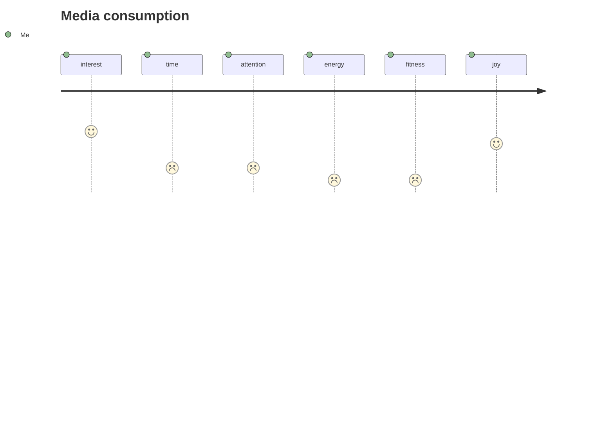

Recently, I'm on *Quest of finding fractal patterns* in behavior. As part of this journey, I realized that

> Every action that I perform either consciously or unconsciously transform me on at least one dimension.
{: .prompt-tip }

For example, when I watch news, I have more knowledge and information  but on other hand I have taken out attention. Such simple action affects me on those 2 dimensions. I do so many things on daily basis without putting much thought into it.

If you look at  every small things that you do and tally how it affects on dimensions that matters to you. You would have more clarity and probably you would able to get most of each atomic action performed.

Let me list down some of these dimensions for me.

- Interest
- Time
- Attention
- Energy
- Fitness/health
- Financial
- Risk
- Joy
  - Blissful
  - Playful
  - fulfilment

Let me share my story about media consumption. I was spending hours and hours on it. After consuming media, I was left with less time, less energy and less attention to all other things that were important to me. It was not adding up on my dimensions.

👆This provides clear picture in my head what is that I'm getting out it.

**Need to do something:**

I reduced noise by reshaping social feeds such FB, twitter, linked-in, youtube and podcast. This lead into amplification of the original problem as now my feed is more interesting and giving more dose of dopamine 🙃. So next I did was myself  *what can I do about interested thing?*  followed by [five why ❓](https://en.wikipedia.org/wiki/Five_whys){:target="blank"} Outcome of this led me understanding myself bit deeper.

- News (once a week only highlights)
- local news (5 minute on podcast as side)
- couple of episodes on tech and startup would (1 hour during commute or walking)
- 1/2 movies or series on Netflix/other streaming app
- whats app and other messaging app (2 to 3 times for less than 5 min)

This whole process not on just gave more freedom but also started having incremental effect on each dimensions that mattered to me. This is also [fractal](https://en.wikipedia.org/wiki/Fractal){:target="blank"} by nature. You can apply it everything. A set of related action can form bigger action and meaningful action and vice versa.

