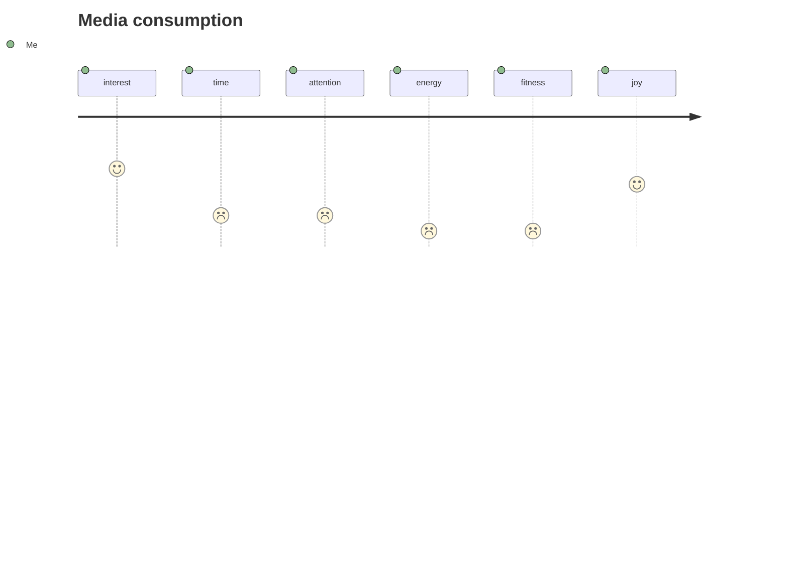

Recently, I've been on a _quest to find fractal patterns_ in behavior. As part of this journey, I realized that

> Every action that I perform, either consciously or unconsciously, transforms me on at least one dimension
{: .prompt-tip }

For example, when I watch the news, I gain more knowledge and information, but on the other hand, I lose attention. Such a simple action affects me on those two dimensions. I do so many things on a daily basis without putting much thought into them.

If you look at every small thing that you do and tally how it affects the dimensions that matter to you, you would have more clarity and probably be able to get the most out of each atomic action performed.

Let me list some of these dimensions for me:

- Interest
- Time
- Attention
- Energy
- Fitness/health
- Financial
- Risk
- Joy
  - Blissful
  - Playful
  - Fulfillment

Let me share my story about media consumption. I was spending hours and hours on it. After consuming media, I was left with less time, less energy, and less attention for all the other things that were important to me. It was not adding up on my dimensions.

👉 This provides a clear picture in my head of what I'm getting out of it.

**Need to do something:**

I reduced noise by reshaping social feeds such as Facebook, Twitter, LinkedIn, YouTube, and podcasts. This led to amplification of the original problem, as now my feed is more interesting and gives a higher dose of dopamine 🤣. So next, I asked myself, _what can I do about interesting things?_ followed by [five whys ❓](https://en.wikipedia.org/wiki/Five_whys){:target="blank"}. The outcome of this led me to understand myself a bit deeper.

- News (once a week, only highlights)
- Local news (5 minutes on a podcast as a side)
- A couple of episodes on tech and startup world (1 hour during commute or walking)
- 1-2 movies or series on Netflix/other streaming apps
- WhatsApp and other messaging apps (2 to 3 times for less than 5 minutes)

This whole process not only gave me more freedom but also started having an incremental effect on each dimension that mattered to me. This is also [fractal](https://en.wikipedia.org/wiki/Fractal){:target="blank"} by nature. You can apply it to everything. A set of related actions can form a bigger and more meaningful action, and vice versa.
