When implementing data structures, making them work with a language's built-in iteration mechanisms is essential for clean, readable code. In this article, we'll explore how to implement the Iterator and Iterable patterns, as well as the Comparable and Comparator interfaces—with practical examples and a dash of fun! 😄


## Iterator & Iterable Patterns

The ability to iterate through a data structure is fundamental in DSA. Implementing custom iterators is straightforward—and even a little fun! 🔄✨

Here's a Mermaid diagram that uses pebbles (circles) to show how an iterator moves through a linked list:

```mermaid
graph LR
    subgraph Linked List
        A((Alice)) --next--> B((Bob)) --next--> C((Charlie))
    end
    style A fill:#f9f,stroke:#333,stroke-width:2px
    style B fill:#bbf,stroke:#333,stroke-width:2px
    style C fill:#bfb,stroke:#333,stroke-width:2px
    Iterator((🔴 Iterator))
    Iterator --points to--> A
    click A "#" "Current element"
    %% As the iterator moves:
    %% 1. Iterator points to A (Alice)
    %% 2. After next(), Iterator points to B (Bob)
    %% 3. After next(), Iterator points to C (Charlie)
```



**How to read this diagram:**
- The circles (pebbles) represent nodes in the linked list.
- The red circle labeled "Iterator" shows the current position of the iterator.
- Each call to `next()` moves the iterator to the next node.

```kotlin
class CustomLinkedList<T> : Iterable<T> {
    private var head: Node<T>? = null

    // Node class definition
    private class Node<T>(val value: T, var next: Node<T>? = null)

    fun add(value: T) {
        if (head == null) {
            head = Node(value)
            return
        }

        var current = head
        while (current?.next != null) {
            current = current.next
        }
        current?.next = Node(value)
    }

    // Implementing the Iterable interface
    override fun iterator(): Iterator<T> = object : Iterator<T> {
        private var current = head

        override fun hasNext(): Boolean = current != null

        override fun next(): T {
            if (!hasNext()) throw NoSuchElementException()
            val value = current?.value
            current = current?.next
            return value!!
        }
    }
}

// Using the custom iterable
val list = CustomLinkedList<String>()
list.add("Alice")
list.add("Bob")
list.add("Charlie")

// Iterating through our custom data structure
for (name in list) {
    println(name)  // Prints: Alice, Bob, Charlie
}

// Or using functional methods
list.forEach { println(it) }
```

This example shows how implementing the `Iterable` interface lets your custom data structure play nicely with higher-order functions and iteration tools. 🎲

### Benefits of Making Data Structures Iterable

1. **Language Integration**: Your data structures work seamlessly with `for` loops and functional operators 🌀
2. **Code Clarity**: Users of your data structure can use familiar iteration patterns 📝
3. **Access to Higher-Order Functions**: Enables use of functions like `map`, `filter`, `fold`, etc. 🛠️

```kotlin
// After implementing Iterable, you can use powerful operations:
val numbers = CustomLinkedList<Int>().apply {
    add(1)
    add(2)
    add(3)
    add(4)
    add(5)
}

val doubled = numbers.map { it * 2 }
val sum = numbers.sum()
val evenNumbers = numbers.filter { it % 2 == 0 }

println("Doubled: $doubled")
println("Sum: $sum")
println("Even numbers: $evenNumbers")
```

## Custom Iterators for Special Traversals

Sometimes, you might want to provide special ways to traverse your data structure. You can! 🌳🧭

```kotlin
class BinaryTree<T> {
    class Node<T>(val value: T, var left: Node<T>? = null, var right: Node<T>? = null)

    var root: Node<T>? = null

    // Insert nodes (simplified implementation)
    fun insert(value: T) {
        // Insert logic here
    }

    // Preorder traversal iterator
    fun preorderIterator(): Iterator<T> = object : Iterator<T> {
        private val stack = ArrayDeque<Node<T>?>()

        init {
            if (root != null) {
                stack.add(root)
            }
        }

        override fun hasNext(): Boolean = stack.isNotEmpty()

        override fun next(): T {
            if (!hasNext()) throw NoSuchElementException()

            val node = stack.removeFirst()!!

            // Add right then left to stack (so left is processed first)
            node.right?.let { stack.addFirst(it) }
            node.left?.let { stack.addFirst(it) }

            return node.value
        }
    }

    // Inorder traversal iterator
    fun inorderIterator(): Iterator<T> = object : Iterator<T> {
        private val stack = ArrayDeque<Node<T>?>()
        private var current = root

        override fun hasNext(): Boolean = current != null || stack.isNotEmpty()

        override fun next(): T {
            if (!hasNext()) throw NoSuchElementException()

            // Traverse to leftmost node
            while (current != null) {
                stack.addFirst(current)
                current = current?.left
            }

            // Get the next node
            val node = stack.removeFirst()!!

            // Move to the right subtree
            current = node.right

            return node.value
        }
    }
}

// Using custom traversal iterators
val tree = BinaryTree<Int>()
// Add nodes to create a tree

// Preorder traversal
println("Preorder traversal:")
val preorderIterator = tree.preorderIterator()
while (preorderIterator.hasNext()) {
    println(preorderIterator.next())
}

// Inorder traversal
println("Inorder traversal:")
val inorderIterator = tree.inorderIterator()
while (inorderIterator.hasNext()) {
    println(inorderIterator.next())
}
```

## Comparable & Comparator Interfaces

Sorting algorithms rely heavily on comparison logic. Implementing these interfaces makes sorting customizable and intuitive—so you can order your data any way you like! 🗂️✨

### Implementing Comparable

```kotlin
// A class that implements Comparable
data class Person(val name: String, val age: Int) : Comparable<Person> {
    override fun compareTo(other: Person): Int {
        // Sort by age by default
        return this.age - other.age
    }
}

// Using the natural ordering (defined by compareTo)
val people = listOf(
    Person("Charlie", 30),
    Person("Alice", 25),
    Person("Bob", 40)
)

val sortedByAge = people.sorted() // Uses compareTo
println(sortedByAge) // [Person(name=Alice, age=25), Person(name=Charlie, age=30), Person(name=Bob, age=40)]
```

### Using Comparators for Custom Sorting

```kotlin
// Using a custom Comparator
val sortedByName = people.sortedWith(compareBy { it.name })
println(sortedByName) // [Person(name=Alice, age=25), Person(name=Bob, age=40), Person(name=Charlie, age=30)]

// Combining multiple comparators
val customComparator = compareBy<Person> { it.name.length }.thenBy { it.age }
val customSorted = people.sortedWith(customComparator)
println(customSorted)
```

### Creating a Binary Search Tree with Comparable

The Comparable interface is particularly useful when implementing binary search trees. 🌲

```kotlin
class BinarySearchTree<T : Comparable<T>> {
    class Node<T>(val value: T, var left: Node<T>? = null, var right: Node<T>? = null)

    private var root: Node<T>? = null

    fun insert(value: T) {
        root = insertRec(root, value)
    }

    private fun insertRec(node: Node<T>?, value: T): Node<T> {
        // Base case: empty tree or end of a branch
        if (node == null) return Node(value)

        // Compare and insert in the appropriate subtree
        when {
            value < node.value -> node.left = insertRec(node.left, value)
            value > node.value -> node.right = insertRec(node.right, value)
            // Equal values not inserted (or handle as desired)
        }

        return node
    }

    fun contains(value: T): Boolean {
        var current = root

        while (current != null) {
            when {
                value < current.value -> current = current.left
                value > current.value -> current = current.right
                else -> return true // Found
            }
        }

        return false
    }

    fun inOrderTraversal(): List<T> {
        val result = mutableListOf<T>()
        inOrderTraversal(root, result)
        return result
    }

    private fun inOrderTraversal(node: Node<T>?, result: MutableList<T>) {
        if (node == null) return

        inOrderTraversal(node.left, result)
        result.add(node.value)
        inOrderTraversal(node.right, result)
    }
}

// Using the BST with a Comparable type
val bst = BinarySearchTree<Int>()
bst.insert(5)
bst.insert(3)
bst.insert(7)
bst.insert(2)
bst.insert(4)

println("Contains 4: ${bst.contains(4)}") // true
println("Contains 6: ${bst.contains(6)}") // false
println("In-order traversal: ${bst.inOrderTraversal()}") // [2, 3, 4, 5, 7]
```

## Implementing a Custom Collection

You can create custom collections by implementing both `Iterable` and `Collection` interfaces. Your data structures can be as powerful as the standard library! 💪

```kotlin
class SortedList<T : Comparable<T>> : Collection<T> {
    private val elements = mutableListOf<T>()

    // Collection interface methods
    override val size: Int get() = elements.size
    override fun isEmpty(): Boolean = elements.isEmpty()
    override fun contains(element: T): Boolean = elements.contains(element)
    override fun containsAll(elements: Collection<T>): Boolean = this.elements.containsAll(elements)

    // Iterable interface method
    override fun iterator(): Iterator<T> = elements.iterator()

    // Custom methods
    fun add(element: T): Boolean {
        // Find position to insert while maintaining sort order
        val index = elements.binarySearch(element).let {
            if (it < 0) -it - 1 else it
        }
        elements.add(index, element)
        return true
    }

    fun remove(element: T): Boolean = elements.remove(element)
}

// Using our custom collection
val sortedList = SortedList<Int>()
sortedList.add(5)
sortedList.add(2)
sortedList.add(8)
sortedList.add(1)

println("Sorted elements: $sortedList") // [1, 2, 5, 8]
println("Contains 2: ${sortedList.contains(2)}") // true
println("Size: ${sortedList.size}") // 4

// Works with standard library functions because it implements Collection
val doubled = sortedList.map { it * 2 }
println("Doubled: $doubled") // [2, 4, 10, 16]
```

## Conclusion

The Iterator and Iterable patterns, along with the Comparable and Comparator interfaces, are fundamental building blocks for creating usable, idiomatic data structures. By implementing these interfaces, you ensure that your custom data structures integrate seamlessly with language constructs and standard libraries. 🎉

In the next article, we'll explore Big-O notation and asymptotic analysis—essential concepts for understanding the efficiency of your data structures and algorithms. Stay tuned for more DSA adventures! 🚀📚
